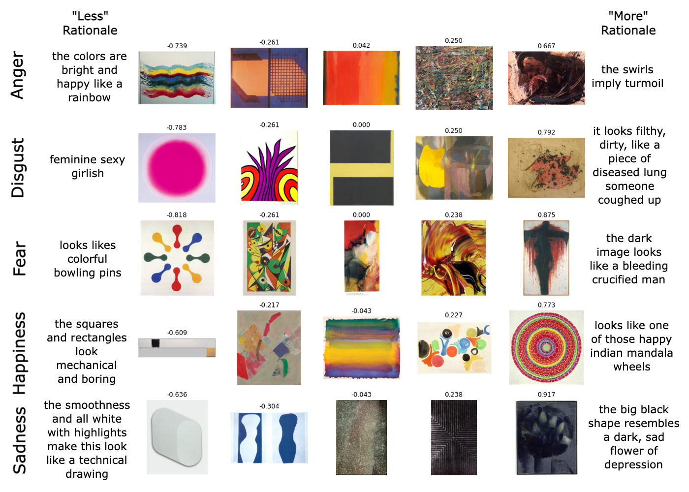

# FeelingBlue: A Corpus for Understanding the Emotional Connotation of Color in Context

Representative examples spanning **FeelingBlue**'s emotion subsets. Each image in an emotion subset has a score between 
-1 and 1 derived from its Best-Worst Scaling annotations.  Images selected as the _least_/_most_ emotional in a 4-tuple 
(not shown here) have rationales explaining why they are _less_/_more_ emotional than the rest. The names and artists 
behind these works can be found [here](fixtures/corpus_sample_artists.txt).

## Dataset

The subset of DeviantArt/WikiArt annotated in **FeelingBlue** can be downloaded
[here](https://drive.google.com/drive/folders/1wIPGNa7AppDY5hI9nPFfe_XrVV8-XyWg?usp=share_link).  The code expects 
to find these images in `corpora/wikiart`.

### Raw 4-Tuple Data

A CSV containing the annotations in **FeelingBlue** can be found [here](corpora/feelingblue.csv).
It is additionally hosted as a HuggingFace Dataset [here](https://huggingface.co/datasets/owinn/feelingblue_data).

Each row in the CSV (and each example in the HuggingFace Dataset) corresponds to the annotation of a single 
4-tuple of images for a single emotion and direction (less/more).  For example, the first example in the CSV
contains an annotation for the 4-images specified in the columns image(1|2|3|4)_id.  The image id in the selected_image_id
column corresponds to the image_id which the annotator believed was angriest of the four images.

Briefly, the columns in the CSV are as follows:

| Column | Description |
| --- | --- |
| task_id | a unique identifier for the combination of emotion and 4-tuple |
| emotion | one of anger, disgust, fear, happiness or sadness |
| annotator | a unique identifier to the annotator who completed this annotation |
| min/max | the direction of the annotation, either MIN or MAX |
| selected_image_id | the image_id of the image which the annotator believed was the least/most emotional of the 4-tuple |
| rationale | the rationale provided by the annotator for their selection |
| image1_id | the image_id of the first image in the 4-tuple |
| image2_id | the image_id of the second image in the 4-tuple |
| image3_id | the image_id of the third image in the 4-tuple |
| image4_id | the image_id of the fourth image in the 4-tuple |
| image1_filename | the filename of the first image in the 4-tuple |
| image2_filename | the filename of the second image in the 4-tuple |
| image3_filename | the filename of the third image in the 4-tuple |
| image4_filename | the filename of the fourth image in the 4-tuple |

### Derived Relative Emotion Scores

A CSV containing the derived relative emotion scores from the BWS annotations in **FeelingBlue** can be found [here](corpora/feelingblue_relative_scores.csv).
The identifiers (``image_id``) and filenames (``filename``) match those in the raw 4-tuple data.

## Training 

### Preprocessing

Training the PaletteApplier requires preprocessing our corpus by :

1. Using the [colorgram](https://pypi.org/project/colorgram.py/) library to identify the 6 most prominent colors in each 
image.  The code expects this to be saved in `corpora/wikiart/colors6.pkl` as a dictionary where the keys are the image 
filenames and the values are the colorgram extraction.

2. Generating differently colored versions of each image in our corpus by shifting its hue but reusing its luminance
using the function `apply_hue_shift()` in [utils/colors.py](utils/colors.py).  The code expects these hue shifted images to be saved in
`corpora/wikiart/hue_shifts`.  

.Extracting the palettes for each of the hue shifted variants and saving them individually in 
`corpora/wikiart/hue_shifts/palettes`.

While you can write code to do this yourself, the resulting palettes and hue-shifted images can be downloaded 
[here](https://drive.google.com/drive/folders/1IwEEIEV8qD78kqb8eokRq_ysLlKOQItO?usp=share_link). 

### Training the EmotionClassifier

To train the EmotionClassifier, the entry script is [train_emotion_classifier.py](train_emotion_classifier.py).  To
recreate our experimental variant, please consult the config file [here](https://drive.google.com/drive/folders/1NmxwxeVydREtIo8kprapzhu-0i_LJQxP?usp=share_link).

### Training the PaletteApplier

To train the PaletteApplier, the entry script is [train_palette_applier.py](train_palette_applier.py).  To
recreate our experimental variant, please consult the config file [here](https://drive.google.com/drive/folders/1NmxwxeVydREtIo8kprapzhu-0i_LJQxP?usp=share_link).

### Training the RationaleRetriever

To train the RationaleRetriever, the entry script is [train_rationale_retriever.py](train_rationale_retriever.py).

## Evaluation

Our pretrained models can be found [here](https://drive.google.com/drive/folders/1NmxwxeVydREtIo8kprapzhu-0i_LJQxP?usp=share_link).

### Transforming Images

Transforming images requires a pretrained EmotionClassifier and PaletteApplier.  The script to do so is [transform_images.py](transform_images.py).
It requires that the images to be transformed are saved in the top level of the directory you specify.  Example usage:

`transform_images('path/to/image/directory', 'path/to/emotion_classifier.pt', 'path/to/palette_applier.pt', 'output_dir')`

### Retrieving Rationales

Retrieving rationales requires a pretrained RationaleRetriever.  The script to do so is [retrieve_rationales.py](retrieve_rationales.py).
It requires the specification of an evaluation CSV that contains 3 columns: `less_image_filepath,more_image_filepath,emotion` where `less_image` is the
image that you want "rationalized" as expressing `emotion` less and `more_image` is the image that you want "rationalized" as expressing `emotion` more.
It will output a CSV at the specified target path with the same columns as the input CSV plus two additional columns: `less_rationales` and `more_rationales` 
which will contain pipe (`|`) delimited strings of the top rationales for each direction.  Example usage:

`retrieve_rationales('path/to/evaluation.csv', 'path/to/rationale_retriever.pt', 'path/to/output.csv')`

